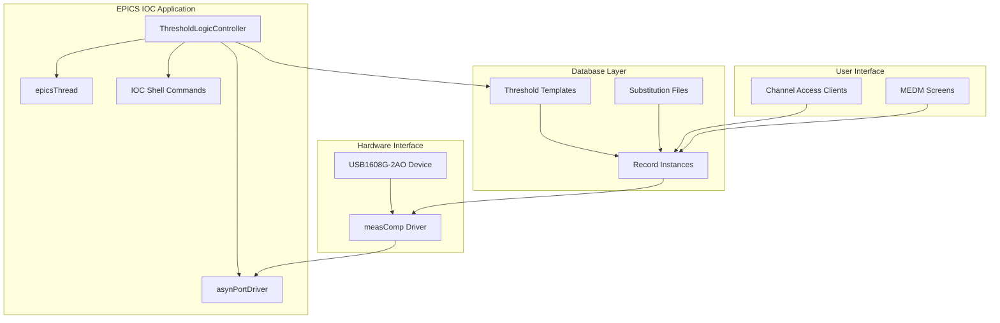

# EPICS IOC 개발 가이드 설계 문서

## 개요

이 설계 문서는 USB1608G-2AO 장치를 위한 완전한 EPICS IOC 프로젝트 개발 가이드를 구현하기 위한 아키텍처와 구성 요소를 정의합니다. 특히 자동 임계값 기반 로직 제어(Automatic Threshold Logic Control) 기능을 중심으로 한 확장 가능한 시스템을 설계합니다.

## 아키텍처

### 전체 시스템 아키텍처



### 컴포넌트 계층 구조

1. **응용 계층 (Application Layer)**
   - ThresholdLogicController 클래스
   - IOC 쉘 명령어 인터페이스
   - 사용자 정의 비즈니스 로직

2. **EPICS 프레임워크 계층 (EPICS Framework Layer)**
   - asynPortDriver 기반 드라이버
   - EPICS 레코드 시스템
   - Channel Access 통신

3. **하드웨어 추상화 계층 (Hardware Abstraction Layer)**
   - measComp 드라이버
   - USB 통신 인터페이스
   - 장치별 프로토콜 처리

## 구성 요소 및 인터페이스

### 1. ThresholdLogicController 클래스

#### 클래스 설계
```cpp
class ThresholdLogicController : public asynPortDriver {
private:
    // 매개변수 인덱스
    int P_ThresholdValue;
    int P_CurrentValue;
    int P_OutputState;
    int P_Enable;
    int P_Hysteresis;
    
    // 스레드 관련
    epicsThread *monitorThread;
    bool threadRunning;
    
    // 임계값 로직 상태
    double thresholdValue;
    double currentValue;
    bool outputState;
    bool enabled;
    double hysteresis;

public:
    ThresholdLogicController(const char* portName, const char* devicePort, int deviceAddr);
    virtual ~ThresholdLogicController();
    
    // asynPortDriver 오버라이드 메서드
    virtual asynStatus writeFloat64(asynUser *pasynUser, epicsFloat64 value);
    virtual asynStatus readFloat64(asynUser *pasynUser, epicsFloat64 *value);
    virtual asynStatus writeInt32(asynUser *pasynUser, epicsInt32 value);
    virtual asynStatus readInt32(asynUser *pasynUser, epicsInt32 *value);
    
    // 임계값 로직 메서드
    void processThresholdLogic();
    void startMonitoring();
    void stopMonitoring();
    
    // 스레드 함수
    static void monitorThreadFunc(void* param);
};
```

#### 인터페이스 정의
- **입력 매개변수**: 임계값, 히스테리시스, 활성화 상태
- **출력 매개변수**: 현재 값, 출력 상태, 알람 상태
- **제어 명령**: 시작/정지, 리셋, 구성 업데이트

### 2. 데이터베이스 템플릿 설계

#### ThresholdLogic.template
```
# 임계값 설정 레코드
record(ao, "$(P)$(R)Threshold") {
    field(DTYP, "asynFloat64")
    field(OUT,  "@asyn($(PORT),$(ADDR))THRESHOLD_VALUE")
    field(PREC, "$(PREC=3)")
    field(EGU,  "$(EGU=V)")
}

# 현재 값 모니터링 레코드
record(ai, "$(P)$(R)CurrentValue") {
    field(DTYP, "asynFloat64")
    field(INP,  "@asyn($(PORT),$(ADDR))CURRENT_VALUE")
    field(SCAN, "I/O Intr")
    field(PREC, "$(PREC=3)")
    field(EGU,  "$(EGU=V)")
}

# 출력 상태 레코드
record(bi, "$(P)$(R)OutputState") {
    field(DTYP, "asynInt32")
    field(INP,  "@asyn($(PORT),$(ADDR))OUTPUT_STATE")
    field(SCAN, "I/O Intr")
    field(ZNAM, "Low")
    field(ONAM, "High")
}

# 활성화 제어 레코드
record(bo, "$(P)$(R)Enable") {
    field(DTYP, "asynInt32")
    field(OUT,  "@asyn($(PORT),$(ADDR))ENABLE")
    field(ZNAM, "Disabled")
    field(ONAM, "Enabled")
}
```

### 3. IOC 쉘 명령어 인터페이스

#### 명령어 등록 함수
```cpp
// IOC 쉘 명령어 등록
static const iocshArg thresholdConfigArg0 = {"portName", iocshArgString};
static const iocshArg thresholdConfigArg1 = {"devicePort", iocshArgString};
static const iocshArg thresholdConfigArg2 = {"deviceAddr", iocshArgInt};

static const iocshArg *thresholdConfigArgs[] = {
    &thresholdConfigArg0,
    &thresholdConfigArg1,
    &thresholdConfigArg2
};

static const iocshFuncDef thresholdConfigFuncDef = {
    "ThresholdLogicConfig", 3, thresholdConfigArgs
};

static void thresholdConfigCallFunc(const iocshArgBuf *args) {
    ThresholdLogicConfig(args[0].sval, args[1].sval, args[2].ival);
}

void ThresholdLogicRegister(void) {
    iocshRegister(&thresholdConfigFuncDef, thresholdConfigCallFunc);
}
```

## 데이터 모델

### 1. 임계값 로직 상태 모델
```cpp
struct ThresholdState {
    double threshold;        // 임계값
    double hysteresis;      // 히스테리시스 값
    double currentValue;    // 현재 측정값
    bool outputState;       // 출력 상태 (true/false)
    bool enabled;          // 활성화 상태
    epicsTimeStamp lastUpdate; // 마지막 업데이트 시간
};
```

### 2. 구성 매개변수 모델
```cpp
struct ThresholdConfig {
    char portName[64];      // 포트 이름
    char devicePort[64];    // 장치 포트 이름
    int deviceAddr;         // 장치 주소
    double updateRate;      // 업데이트 주기 (Hz)
    int priority;          // 스레드 우선순위
};
```

## 오류 처리

### 1. 오류 분류
- **구성 오류**: 잘못된 매개변수, 포트 연결 실패
- **통신 오류**: 장치 통신 실패, 타임아웃
- **런타임 오류**: 스레드 생성 실패, 메모리 부족

### 2. 오류 처리 전략
```cpp
class ErrorHandler {
public:
    enum ErrorLevel {
        INFO,
        WARNING,
        ERROR,
        FATAL
    };
    
    static void logError(ErrorLevel level, const char* source, const char* message);
    static void setAlarmStatus(asynUser* pasynUser, int status, int severity);
    static bool validateConfiguration(const ThresholdConfig& config);
};
```

### 3. 알람 및 상태 보고
- EPICS 알람 시스템 통합
- 상태 레코드를 통한 실시간 모니터링
- 로그 파일을 통한 오류 추적

## 테스트 전략

### 1. 단위 테스트
- ThresholdLogicController 클래스 메서드 테스트
- 임계값 로직 알고리즘 검증
- 오류 처리 시나리오 테스트

### 2. 통합 테스트
- EPICS 레코드와 드라이버 간 통신 테스트
- IOC 시작 및 종료 시나리오 테스트
- 실제 하드웨어와의 연동 테스트

### 3. 성능 테스트
- 실시간 모니터링 성능 측정
- 메모리 사용량 모니터링
- CPU 사용률 최적화 검증

### 4. 테스트 자동화
```bash
# 단위 테스트 실행
make test-unit

# 통합 테스트 실행
make test-integration

# 성능 테스트 실행
make test-performance
```

## 배포 및 설치

### 1. 빌드 시스템 통합
- 기존 EPICS Makefile 시스템과 통합
- 의존성 관리 및 링킹 규칙 정의
- 크로스 플랫폼 빌드 지원

### 2. 설치 패키지
- 소스 코드 및 헤더 파일
- 데이터베이스 템플릿 및 치환 파일
- 문서 및 예제 파일
- 테스트 스크립트 및 도구

### 3. 구성 관리
- 버전 관리 및 릴리스 프로세스
- 구성 파일 템플릿 제공
- 업그레이드 및 마이그레이션 가이드